# Deskripsi aplikasi web

Aplikasi web ini merupakan sebuah platform sederhana yang memungkinkan pengguna untuk mendengarkan musik dan menelusuri album, dengan inspirasi yang diambil dari Spotify. Dikembangkan tanpa menggunakan framework, aplikasi ini dirancang menggunakan PHP, HTML, CSS, dan JS, dengan implementasi Ajax menggunakan XHR. Database aplikasi disimpan di awan dengan menggunakan PostgreSQL. Proyek ini diinisiasi sebagai bagian dari tugas besar dalam mata kuliah Pemrograman Aplikasi Berbasis Web.

# Daftar requirement

# Cara instalasi

1. Clone repository ini
2. Install XAMPP

# Cara menjalankan server

### XAMPP

Pindahkan isi dari repository ini ke htdocs pada XAMPP. Konfigurasi database dapat dilihat pada inc/dotenv.php .

### Terminal 

1. cd public
2. jalankan command php -S localhost:portnumber

# Screenshot tampilan aplikasi

### Login Page

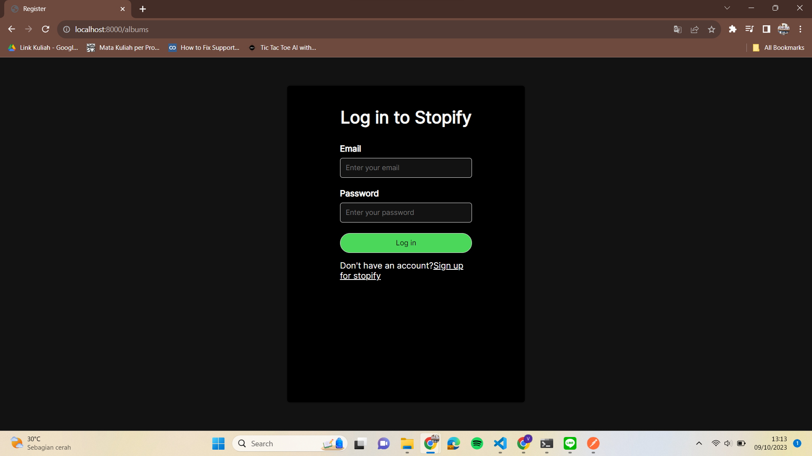

### Register Page

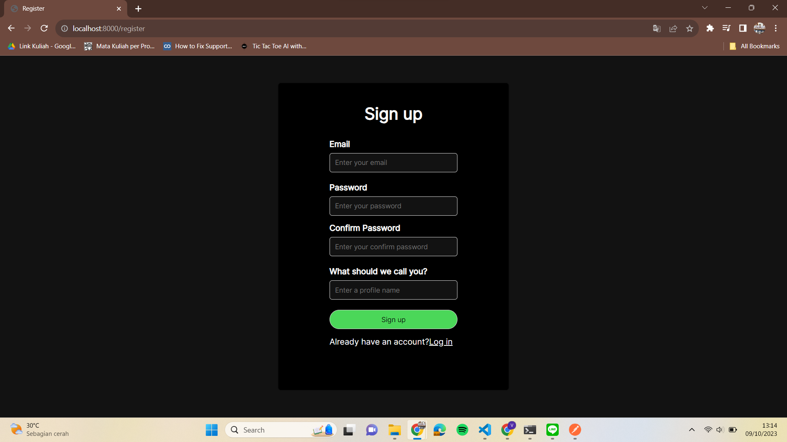

### Home Page

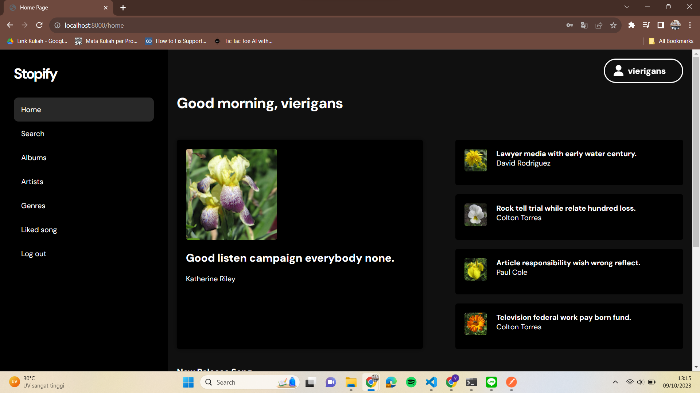

### Search, Sort, Filter Page

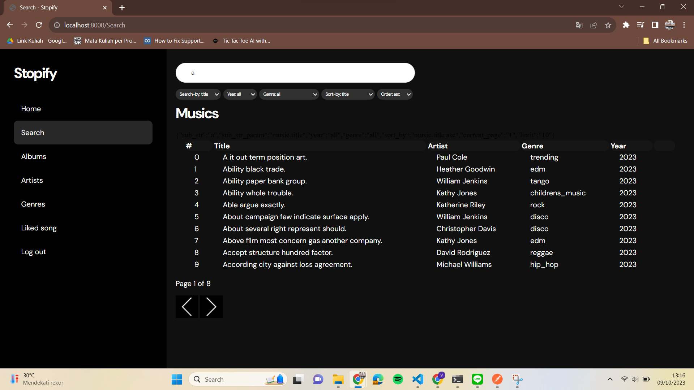

### Daftar Album Page

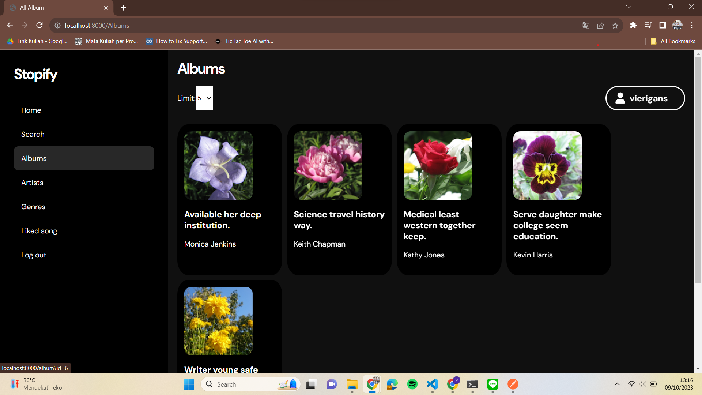

### Detail Album Page

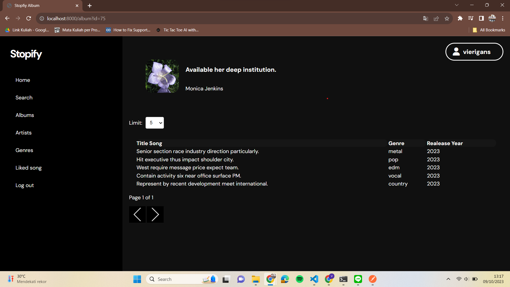

### Detail Lagu Page

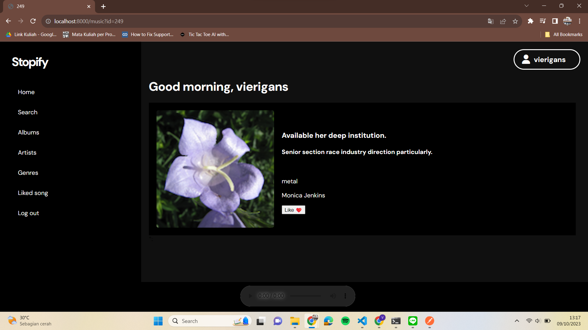

### Daftar Artist

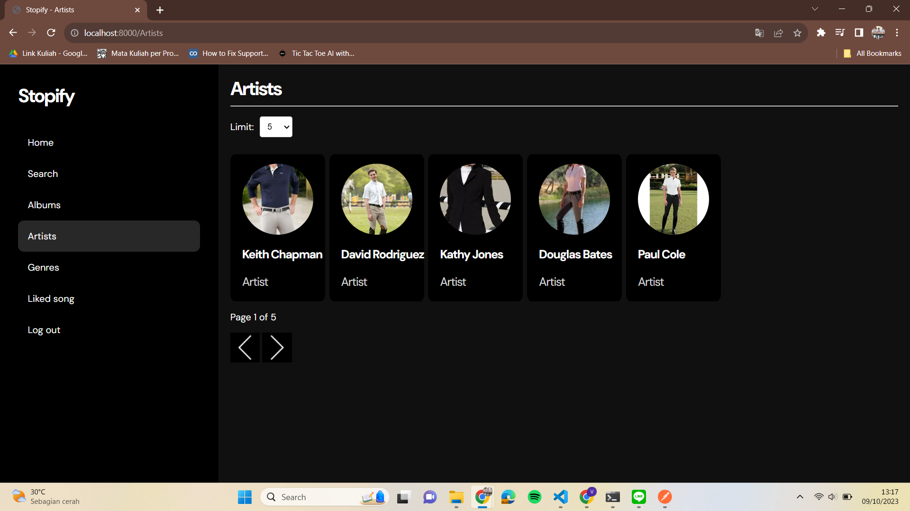

### Daftar Genre

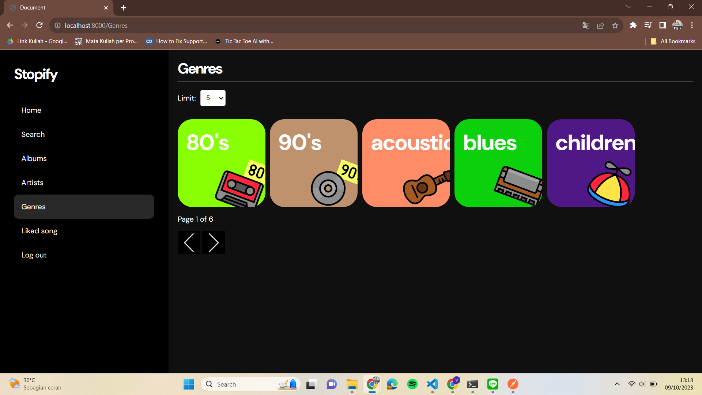

### Daftar Liked Song

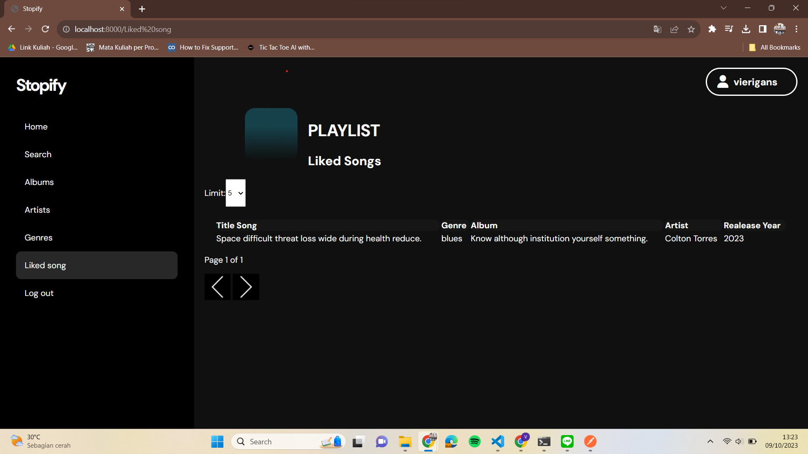

### Edit Album

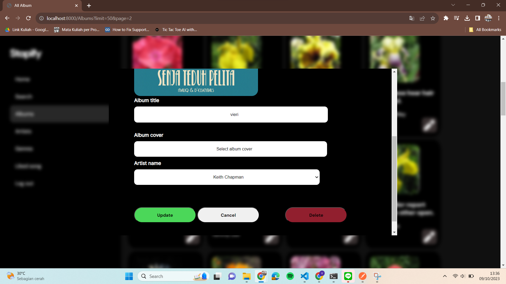

### Edit Lagu

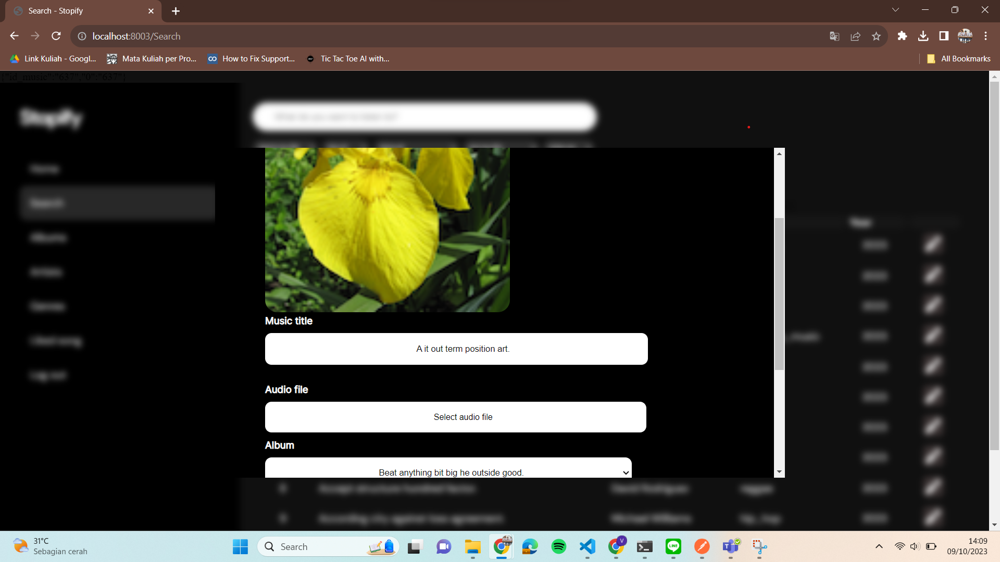

### Edit Genre

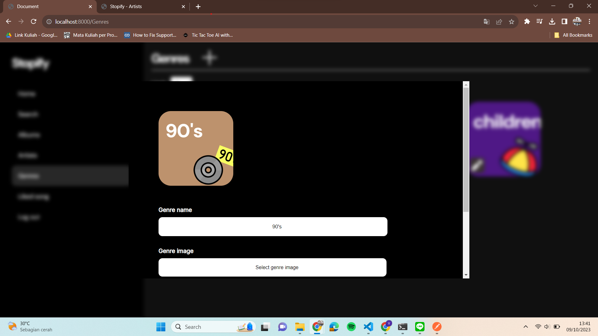

### Tambah Album

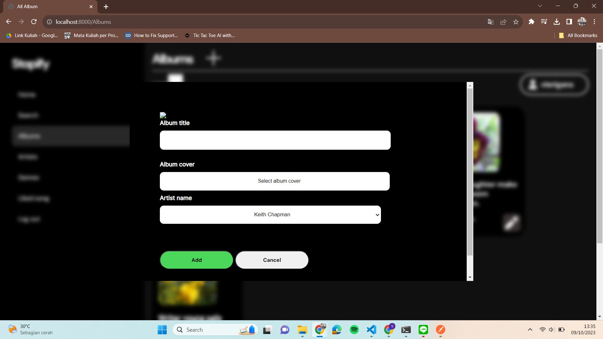

### Tambah Lagu

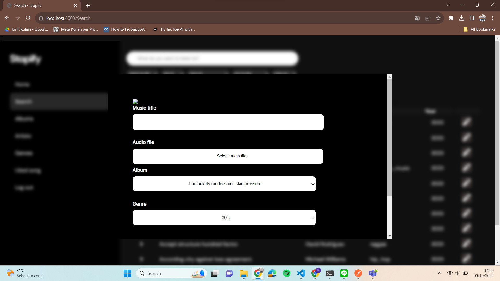

### Tambah Genre

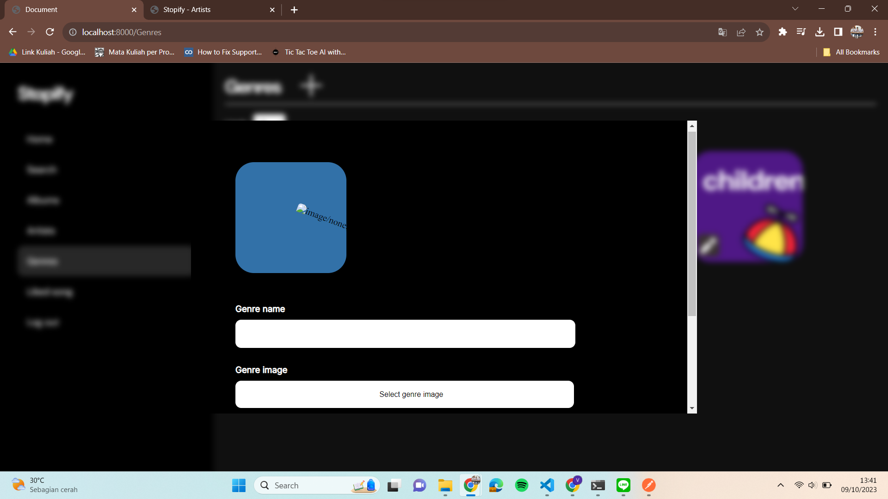

# Pembagian tugas

## Frontend / Client-side

1. Login: 13521099
2. Register: 13521099
3. Home: 13521099
4. Daftar Album: 13521099
5. Daftar Genre : 13521056, 13521099
6. Daftar Artist : 13521056, 13521099
5. Search, Sort, Filter: 13521056
6. Detail Lagu: 13521099
7. Detail Album: 13521099
8. Edit Lagu: 13521056
9. Edit Album: 13521056
10. Edit Genre : 13521056
11. Edit Artist : 13521056
10. Tambah Album: 13521056
11. Tambah Lagu: 13521056
14. Navbar: 13521056
15. Responsive Adjustments: 10023089, 13521056, 13521099
16. Global Styling: 10023089, 13521056, 13521099
17. Initial Design: 10023089, 13521056, 13521099

## Backend / Server-side

1. Auth (Login, Register, Logout): 13521056, 13521099
3. Home: 13521056, 13521099
4. Search, Sort, Filter: 13521056, 13521099
5. Detail Lagu: 13521056, 13521099
6. Detail Album: 13521056, 13521099
7. Daftar Album: 13521056, 13521099
8. Edit Lagu: 13521056, 13521099
9. Edit Album: 13521056, 13521099
10. Tambah Album: 13521056, 13521099
11. Tambah Lagu: 13521056
13. Initial Project, Database : 10023089, 13521056, 13521099
